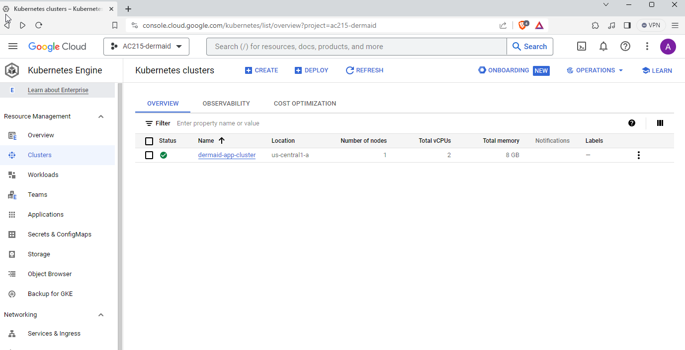
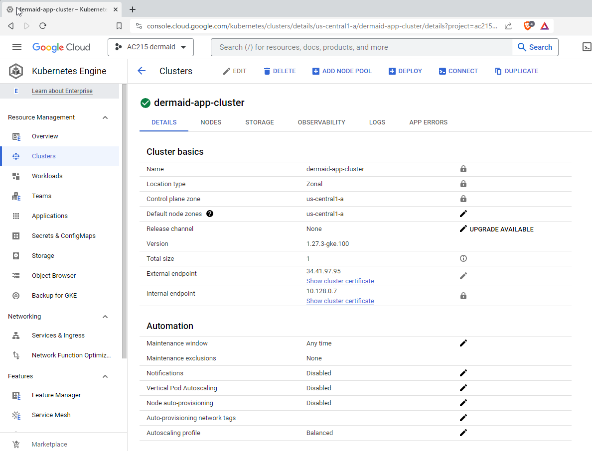
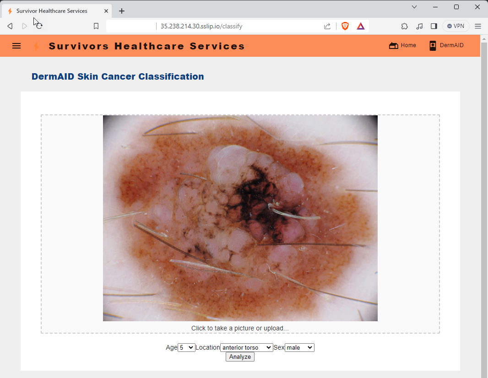
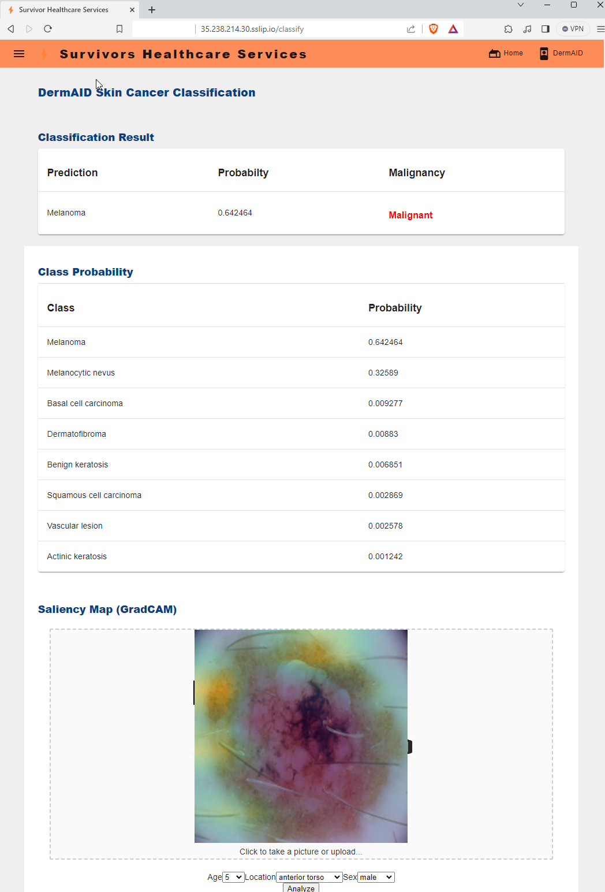
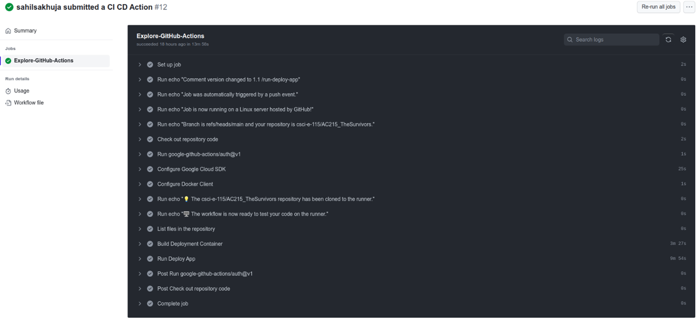

#  CS115: Advanced Practical Data Science 

## Final Project: DermAID - Skin Cancer Detection


**Harvard University, Spring 2023**<br/>
**Instructors**: Pavlos Protopapas<br/>
**Teaching Assistant**: Andrew Smith


**Group nickname: The Survivors**: 

* Arash Sarmadi,   
* Artemio Mendoza,   
* Georg Ziegner,   
* Sahil Sakhuja,   
* Michael Choi,


<hr style="height:2pt">

Welcome to DermAID —  In today's era where healthcare meets technology, early detection of diseases can be the key to successful treatments. Skin cancer, being one of the most common types of cancer, often goes unnoticed until it reaches a critical stage. Our mission? To aid in the early detection of skin cancer by leveraging the power of deep learning.

DermAID aims to classify eight different types of skin lesions, bridging the gap between consumers and dermatologists. With consumers uploading images for classification and dermatologists labeling them for future dataset enrichment, our tool not only educates regular people but also continues to learn and improve over time.


<a id="contents"></a>
## Table of Contents

1. [Project Introduction and Organization](#organization)
2. [Final proposed solution](#solution)
3. [Deployment with Kubernetes](#scaling)  
4. [CI/CD using Github Actions](#ci/cd)
5. [Containers from previous milestones](#containers)
6. [References](#references)

<a id="organization"></a>
## 1. Introduction and Project organization
### Description
Develop a web application that can assist in early detection of skin cancer by classifying eight different types of skin lesions through deep learning models. The web application will have 2 types of users:
1. Consumers: Users who would be interested in finding out what a specific skin lesion is and would be using the app to make inferences on images uploaded by them.
2. Dermatologists: Users who can view the images uploaded and assign correct labels to the images thereby creating datasets for further model fine-tuning in the future.


### Project Organization
<summary>Click on details to expand
</summary>
<details>


Project Organization
------------
      ├── README.md
      ├── LICENSE
      ├── .gitignore
      ├── .gitmodules
      ├── images
      │  ├── 01-get-raw-data.png
      │  ├── 02-prepricess-data-test.png
      │  ├── 03-train-model.png
      │  ├── 04-classify-n-upload.png
      │  ├── 05-saliency-maps.png
      │  ├── api_response.jpeg
      │  ├── api-server.png
      │  ├── architecture.png
      │  ├── architecture_2.png
      │  ├── Base_Model.jpg
      │  ├── classify_post.png
      │  ├── cloudrun-prediction.png
      │  ├── cloudrun-saliency.png
      │  ├── container4-postman.png
      │  ├── container5-postman.png
      │  ├── CPU.png
      │  ├── DeployedApp.png
      │  ├── distillation_performance.png
      │  ├── dockercompose.png
      │  ├── experiment_tracking_wandb_pg1.png
      │  ├── experiment_tracking_wandb_pg2.png
      │  ├── frontend.jpeg
      │  ├── frontend_2.jpeg
      │  ├── frontend_3.jpeg
      │  ├── Frontend_VM_instance.png
      │  ├── Frontend-v2.png
      │  ├── GPU.png
      │  ├── gradcam_post.png
      │  ├── LabelStudio_CustomTemplate.png
      │  ├── multi-GPU.png
      │  ├── pipeline-flowchart.png
      │  ├── pipeline-flowchart-v2.jpg
      │  ├── saliency-map_example1.png
      │  ├── saliency-map_example2.png
      │  ├── saliency-map_example3.png
      │  ├── Screenshot_MS3_Container02_DVC-Push.png
      │  ├── Screenshot_MS3_DVC-TestRun-C2.png
      │  ├── Screenshot_MS3_DVC-TestRun-C3.png
      │  ├── TFRecords.png
      │  ├── vertex-pipeline-running.png
      │  ├── Vertex_Screenshot_1.png
      │  ├── Vertex_Screenshot_2.png
      │  ├── vertexAI-pipeline.png
      │  ├── VertexAI_01_Piepeline_WithVersioning.png
      │  ├── VertexAI_02_ShardsCreated.png
      │  ├── VertexAI_03_Version22Created.png
      │  ├── VertexAI_04_Version22Fetched.png
      │  └── WhyLabs_Profiles.png
      ├── notebooks
      │  └── ISIC_Db_Initial_EDA.ipynb
      ├── presentations
      │  └── 20231026_midterm_presentation.pdf
      ├── reports
      │  ├── milestone-2.md
      │  ├── milestone-3.md
      │  └── milestone-4.md
      └── src
            ├── 01_get_raw_data
            │   ├── .dockerignore
            │   ├── .gitignore
            │   ├── Dockerfile
            │   ├── docker-shell.sh
            │   ├── get_data.py
            │   ├── Pipfile
            │   ├── Pipfile.lock
            │   └── README.md
            ├── 02_preprocess_data
            │   ├── .dockerignore
            │   ├── .gitignore
            │   ├── preprocess_data.py
            │   ├── docker-shell.bat
            │   ├── docker-shell.sh
            │   ├── Dockerfile
            │   ├── Pipfile
            │   ├── Pipfile.lock
            │   └── README.md
            ├── 03_train_model
            │   ├── utilities
            │   │ ├── __init__.py
            │   │ ├── model_compression.py
            │   │ ├── model_quantization.py
            │   │ └── utils.py
            │   ├── .dockerignore
            │   ├── .gitignore
            │   ├── training.py
            │   ├── docker-shell.bat
            │   ├── docker-shell.sh
            │   ├── Dockerfile
            │   ├── dvc_pull.sh
            │   ├── Pipfile
            │   ├── Pipfile.lock
            │   ├── README.md
            │   ├── run-commands.sh
            │   └── run-training.sh
            ├── 04_classify_n_upload
            │   ├── data
            │   │ ├── ISIC_0026403.jpg
            │   │ ├── ISIC_0026421.jpg
            │   │ ├── ISIC_0026456.jpg
            │   │ ├── ISIC_0026531.jpg
            │   │ └── ISIC_0026546.jpg
            │   ├── .gitignore
            │   ├── mock_app_prediction.py
            │   ├── docker-shell.bat
            │   ├── docker-shell.sh
            │   ├── Dockerfile
            │   ├── README.md
            │   ├── requirements.txt
            │   └── sample_curl.sh
            ├── 05_saliency_maps
            │   ├── data
            │   │ ├── ISIC_0026403.jpg
            │   │ ├── ISIC_0026421.jpg
            │   │ ├── ISIC_0026456.jpg
            │   │ ├── ISIC_0026531.jpg
            │   │ └── ISIC_0026546.jpg
            │   ├── mock_app_saliency_maps.py
            │   ├── docker-shell.sh
            │   ├── Dockerfile
            │   ├── README.md
            │   ├── requirements.txt
            │   └── sample_curl.sh
            ├── 06_labeling
            │   ├── label_studio.py
            │   ├── docker-compose.yml
            │   ├── docker-shell.bat
            │   ├── docker-shell.sh
            │   ├── Dockerfile
            │   ├── Pipfile
            │   ├── Pipfile.lock
            │   └── README.md
            ├── 07_frontend
            │   ├── api-service
            │   │ ├── api
            │   │ │ ├── model.py
            │   │ │ ├── service.py
            │   │ │ └── simple_call.py
            │   │ ├── docker-entrypoint.sh
            │   │ ├── docker-shell.bat
            │   │ ├── docker-shell.sh
            │   │ ├── Dockerfile
            │   │ ├── Pipfile
            │   │ └── Pipfile.lock
            │   ├── data
            │   │ ├── ISIC_0026403.jpg
            │   │ ├── ISIC_0026421.jpg
            │   │ ├── ISIC_0026456.jpg
            │   │ ├── ISIC_0026531.jpg
            │   │ └── ISIC_0026546.jpg
            │   ├── deployment
            │   │ ├── nginx-conf
            │   │ │ └── nginx
            │   │ │   └── nginx.conf
            │   │ ├── .gitignore
            │   │ ├── deploy-create-instance.yml
            │   │ ├── deploy-docker-images.yml
            │   │ ├── deploy-provision-instance.yml
            │   │ ├── deploy-setup-containers.yml
            │   │ ├── deploy-setup-webserber.yml
            │   │ ├── docker-entrypoint.sh
            │   │ ├── docker-shell.bat
            │   │ ├── docker-shell.sh
            │   │ ├── Dockerfile
            │   │ └── inventory.yml
            │   ├── frontend-react
            │   │ ├── conf
            │   │ │ └── conf.d
            │   │ │   └── default.conf
            │   │ ├── public
            │   │ │ ├── favicon.ico
            │   │ │ ├── index.html
            │   │ │ └── manifest.json
            │   │ ├── src
            │   │ │ ├── app
            │   │ │ │  ├── App.css
            │   │ │ │  ├── App.js
            │   │ │ │  ├── AppRoutes.js
            │   │ │ │  └── Theme.js
            │   │ │ ├── common
            │   │ │ │  ├── Content
            │   │ │ │  │ ├── index.js
            │   │ │ │  │ └── styles.js
            │   │ │ │  ├── Footer
            │   │ │ │  │ ├── index.js
            │   │ │ │  │ └── styles.js
            │   │ │ │  └── Header
            │   │ │ │    ├── index.js
            │   │ │ │    └── styles.js
            │   │ │ ├── components
            │   │ │ │  ├── Error
            │   │ │ │  │ └── 404.js
            │   │ │ │  └── Home
            │   │ │ │    ├── index.js
            │   │ │ │    └── styles.js
            │   │ │ ├── services
            │   │ │ │  ├── Common.js
            │   │ │ │  └── DataService.js
            │   │ │ ├── index.css
            │   │ │ └── index.js
            │   │ ├── .env.development
            │   │ ├── .env.production
            │   │ ├── .gitignore
            │   │ ├── docker-shell.bat
            │   │ ├── docker-shell.sh
            │   │ ├── Dockerfile
            │   │ ├── Dockerfile.dev
            │   │ ├── nginx.conf
            │   │ ├── package.json
            │   │ └── yarn.lock
            │   ├── frontend-react2
            │   │ ├── images
            │   │ │ ├── app-building-crashcourse.png
            │   │ │ ├── react-01.png
            │   │ │ ├── react-02.png
            │   │ │ ├── react-04.png
            │   │ │ ├── react-05.png
            │   │ │ ├── react-06.png
            │   │ │ └── react-07.png
            │   │ ├── public
            │   │ │ ├── index.html
            │   │ │ └── manifest.json
            │   │ ├── src
            │   │ │ ├── app
            │   │ │ │  ├── App.css
            │   │ │ │  ├── App.js
            │   │ │ │  ├── AppRoutes.js
            │   │ │ │  └── Theme.js
            │   │ │ ├── common
            │   │ │ │  ├── Content
            │   │ │ │  │ ├── index.js
            │   │ │ │  │ └── styles.js
            │   │ │ │  ├── Footer
            │   │ │ │  │ ├── index.js
            │   │ │ │  │ └── styles.js
            │   │ │ │  └── Header
            │   │ │ │    ├── index.js
            │   │ │ │    └── styles.js
            │   │ │ ├── components
            │   │ │ │  ├── Classify
            │   │ │ │  │ ├── index.js
            │   │ │ │  │ └── styles.js
            │   │ │ │  ├── Error
            │   │ │ │  │ └── 404.js
            │   │ │ │  ├── Home
            │   │ │ │  │ ├── index.js
            │   │ │ │  │ └── styles.js
            │   │ │ │  └── TOC
            │   │ │ │    ├── index.js
            │   │ │ │    └── styles.js
            │   │ │ ├── services
            │   │ │ │  ├── Common.js
            │   │ │ │  └── DataService.js
            │   │ │ ├── index.css
            │   │ │ └── index.js
            │   │ ├── .dockerignore
            │   │ ├── .env.development
            │   │ ├── .env.production
            │   │ ├── .gitignore
            │   │ ├── docker-shell.bat
            │   │ ├── docker-shell.sh
            │   │ ├── Dockerfile
            │   │ ├── Dockerfile.dev
            │   │ ├── package.json
            │   │ └── yarn.lock
            │   └── README.md
            ├── 08_versioning
            │   ├── .dvc
            │   │ ├── .gitignore
            │   │ └── config
            │   ├── .dvcignore
            │   ├── .gitignore
            │   ├── Check_Version_Download.ipynb
            │   ├── cli.py
            │   ├── cli_old.py
            │   ├── dermaid_uploads.dvc
            │   ├── docker-shell.sh
            │   ├── Dockerfile
            │   ├── Pipfile
            │   ├── Pipfile.lock
            │   ├── README.md
            │   ├── Versioning.dvc
            │   ├── dvc_push.sh
            │   └── run-commands.sh
            └── 09_run_kfp
                ├── .dockerinore
                ├── .gitignore
                ├── run-kfp.py
                ├── docker-entrypoint.sh
                ├── docker-shell.bat
                ├── docker-shell.sh
                ├── Dockerfile
                ├── Pipfile
                ├── Pipfile.lock
                └── README.md
</details>


<a id="solution"></a>
## 2. Final Proposed Solution
[Return to Table of Contents](#contents)`

In the previous milestones we  developed our solution in a series of cumulative steps, including:

    - created data pipelines, 
    - trained our predictive model
    - deployed the model to GCP
    - created a backend API server to access the deployed model
    - developed a front end using react
    - automatic deployment to GCP using Ansible

the final steps to make our application deployable and available, were to ensure scalability using Kubernetes clusters, and CI/CD capabilities.

In the following sections we describe the steps to implement the application, either in GCP or locally (option listed in Container *07_frontend/deployment*).

<a id="miscellaneous"></a>
### 2.1 Miscellaneous improvements
[Return to Table of Contents](#contents)

For our final version, we improved the UI app to:

- allows the users to enter relevant metadata for the prediction
- return saliency map of the predicted image
- include a link for the panel of experts to review the prediction

<a id="scaling"></a>
## 3. Scaling using Kubernete clusters
[Return to Table of Contents](#contents)

To optimize accessibility and performance, our model uses Kubernetes clusters to deploy the API backend and our WebApp frontend.

The architecture focuses on scalability, enabling handling of increased requests without performance loss. It also incorporates failover mechanisms for continuous operation and load balancing to evenly distribute computational load, preventing bottlenecks. 

The deployment is managed from a docker container.**With the help of Ansible Playbook scripts**, we can manage creating and updating the K8 clusters.

In the following section we list the steps to deploy DermAID to a K8s cluster on GCP.

<a id="step1"></a>

### 3.1 Step 1 - enable GCP APIs
We need to enable all the APIs in GCP that are needed for K8. For that, search for each of these in the GCP search bar and click enable to enable these API's

* Compute Engine API
* Service Usage API
* Cloud Resource Manager API
* Google Container Registry API
* Kubernetes Engine API

<a id="step2"></a>

### 3.2 Step 2 - Start Deployment Docker Container

We need to start the docker container with the image for creating the K8 clusters. For that:

-  change directory to deployment by

    ```bash
    cd deployment
    ```
- start docker container   
    unix:
    ```bash
    sh docker-shell.sh
    ```
    
    windows   

    ```batch
    docker-shell.bat
    ```

- Check versions of tools
    ```bash 
    gcloud --version
    kubectl version
    kubectl version --client
    ```

- Check if make sure you are authenticated to GCP
    ```bash
    gcloud auth list
    ```

<a id="step3"></a>

### 3.3 Step 3 - Create & Deploy Cluster

```
ansible-playbook deploy-k8s-cluster.yml -i inventory.yml --extra-vars cluster_state=present
```
Below we can observe our K8 cluster named *dermaid-app-cluster* created in GPC, as well as the external EndePoint IP





#### View the App
* Copy the `nginx_ingress_ip` from the terminal from the create cluster command
* Go to `http://<YOUR INGRESS IP>.sslip.io`

        **Note**: Using sslip.io in conjunction with your ingress IP address in Kubernetes on GCP (Google Cloud Platform) is a method to simplify the process of mapping a public IP address to a domain name, particularly when you don't own a domain or don't want to configure DNS settings for a small project or a temporary environment.

Now, we can observe the landing page of the application, deployed on GCP. Then, we can analize a sample from the image database



And, finally, obtain a prediction




#### Delete Cluster
```bash
ansible-playbook deploy-k8s-cluster.yml -i inventory.yml --extra-vars cluster_state=absent
```

<a id="ci/cd"></a>
## 4. CI/CD with Github Actions
[Return to Table of Contents](#contents)

After deploying a Kubernetes cluster, our last task was to implement CI/CD automation through Github Actions. 

We created a separate Kkubernetes update script which is triggered by Github Actions when the commit message contains “/run-app-deploy". This automatically rebuilds the 3 containers (frontend, api-service and labeling), publishes them to Google Container Registry and updates the deployment of these containers on the Kubernetes Cluster.



---
<a id="containers"></a>
<summary>

## 5. Containers from previous Milestones
  
[Return to Table of Contents](#contents)

Note: For better readability of this file, we will only give a short overview of each container below. More details on each container can be found in dedicated README files for each container.


> **Note**: The list of containers is collapsed, please, click on <b>Details</b> to expand it.
</summary>
<details> 

---

**Container 01: Data Download**

This container is the first part of our data pipeline. It downloads the zipped images from the ISIC 2019 Challenge website, extracts images and uploads them to GCS. It also downloads metadata and labels and stores them in a GCS bucket.

[More information](src/01_get_raw_data/README.md)

---

**Container 02: Data Preprocessing**

This container is the second part of our data pipeline. It collects the raw data from GCS, converts it into tf Datasets and then stores the complete datasets as tfrecords, back into GCS.

[More information](src/02_preprocess_data/README.md)

---

**Container 03: Model Training**

This container performs the training of our models. It can run both locally and serverless on VertexAI. It collects the tfrecords datasets stored on GCP. In order to pull the correct data, the container requires first to download the versioned pickle file containing the paths to the tfrecords files to be used for training (based on the version tag supplied as a command line argument when creating the vertex AI pipeline), and then creates the model and performs the training.

The container supports multi-GPU training via a configurable parameter. It also has experiment tracking using Weights & Biases. Optional model compression methods are also implemented.

[More information](src/03_train_model/README.md)

---

**Container 04: Inference API**

This container uses a trained model from GCS produced by container 03 to classify new images.
FastAPI is implemented to expose RESTful API for classification, to be used by the front-end application to upload image and metadata for classification. It will also upload the metadata, the raw and preprocessed new image to GCS afterwards.
A CLI is also included to perform the same functionalities.
These data will be used by containers 5 and 6 for Saliency Maps and Labelling.

[More information](src/04_classify_n_upload/README.md)

---

**Container 05: Saliency Maps API**

This container exposes an API that can be called from the frontend application to upload an image and retrieves the model prediction and the original image with a saliency map overlay showcasing the significant areas of the image which impacted the prediction.

[More information](src/05_saliency_maps/README.md)

---

**Container 06: Label Studio**

This container handles our app's second front-end for our other users i.e. Dermatologists, using Label Studio. Dermatologists will be able to use Label Studio to assign the correct labels to different images uploaded by the actual end users of our web app.
Iput to the container are unlabeled patient images and environment variables for Google Cloud Services. 
Output from the container are labeled patient images stored in Google Cloud Storage.

[More information](src/06_labeling/README.md)

---

**Container 07: FrontEnd**

This container handles the frontend, the api-services, and the ansible playbooks for deployment.

The frontend was is based on reac framework, and the api-services are implemented using FastAPI, as a wrapper for the CloudRun end-points.

The deployment to GCP is performed using Ansible Playbooks in automated fashion. It includes the following steps:

* Build and push Docker images with code to the Google Container Registry (GCR)
* Provision Virtual Machine Instance and install all dependencies
* Setup Docker Images from GCR into the VM instance
* Setup Nginx webserver as a reverse proxy

Click here for [detailed information on how to deploy the app](src/07_frontend/README.md) on how to deploy the application.


[More information](src/07_frontend/README.md)

---

**Container 08: Versioning**

This is a separate git project to track and version the datasets in the DermAID App.
We will be using data versioning for fine-tuning the model based on labeling done by Dermatologists. The end result of the pre-processing of data in Container 2 is the creation of tfrecords on GCP. At the end of the pre-processing, the paths created by Container 2 are stored in a temp file on GCP. This container is the next step in the Vertex Pipeline - it downloads the temporary file created by Container 2 and versions it using the tag supplied as a CLI argument when creating the Vertex pipeline.
Input to the container are: GCP credentials, GCP bucket & project details, Git credentials and tag.
Output from the container is an updated DVC file which is commited to the Git repo with the specified commit message and tag.

[More information](https://github.com/csci-e-115/dermaid-versioning/tree/milestone4)

---
**Container 09: Vertex AI Pipeline Runner**

This container constructs the Kubeflow Pipeline and submit to Vertex AI to run. It will compile the defined pipeline and container configuration into pipeline.yaml for job submission.
It assumes containers it used in the pipeline to have already been uploaded to a container repo such as dockerhub. In this case they are:
  - container 1: crispinnosidam/01-get-raw-data
  - container 2: crispinnosidam/02-preprocess-data
  - container 3: sahilsakhuja/dermaid-versioning
  - container 4: crispinnosidam/03-train-model

[More information](src/09_run_kfp/README.md)
</details>

<a id="references"></a>
## 6. References
[Return to Table of Contents](#contents)

1. : BCN_20000 Dataset: (c) Department of Dermatology, Hospital Clínic de Barcelona  

2. : HAM10000 Dataset: (c) by ViDIR Group, Department of Dermatology, Medical University of Vienna; https://doi.org/10.1038/sdata.2018.161  

3. : MSK Dataset: (c) Anonymous; https://arxiv.org/abs/1710.05006; https://arxiv.org/abs/1902.03368  
