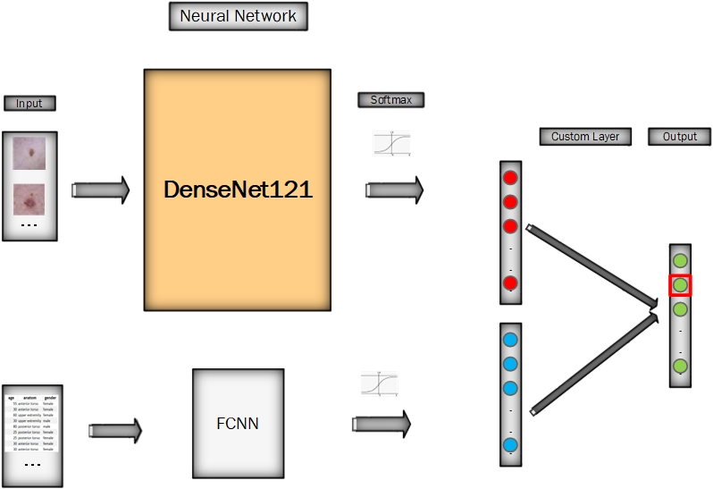
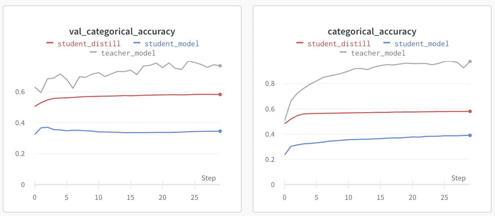

# Model Training Based on Versioned Data

This container performs the training of our models. It collects the tfrecords datasets stored on GCP. In order to pull the correct data, the container requires first to download the versioned pickle file containing the paths to the tfrecords files to be used for training, and then creates the model and performs the training.

The container supports multi-GPU training via a configurable parameter. It also has experiment tracking using Weights & Biases. Optional model compression methods are also implemented.

<a id="contents"></a>
## Table of Contents

1. [Deployment](#1-deployment)
2. [Deployment on Vertex AI pipeline](#2-deployment-on-vertex-ai-pipeline)
3. [Usage](#2-features)
4. [Model Structure](#4-model-structure)
5. [File structure and dependencies](#5-file-structure-and-dependencies)
6. [Challenges & Solutions](#6-challenges--solutions)
7. [Versioning showcase](#7-versioning-showcase)

## 1. Deployment

### To deploy this container locally run

```bash
  sh docker-shell.sh
```
Commands to run inside docker container to execute pull versioned data and execute training:

    sh dvc_pull.sh
    python cli.py

The container has the following requirements:

1. `secrets` folder with the json credentials for GCP and credentials for WANDB -- File names expected are `ac215-dermaid.json` and `wandb.txt`
2. `git.txt` file also in `secrets` folder: An file with a single line containing git login info for DVC usage
    ```
    https://<github username>:<github token>
    ```

### 2. Deployment on Vertex AI pipeline

The Dockerfile will run
```bash
run-commands.sh
```
by default, and expects the following parameters:
- $1 GCP_PROJECT - project name of GCP
- $2 GCS_BUCKET_NAME - bucket name of GCS
- $3 GIT_LOGIN - login name and token, in the format of `https://<username>:<token>
- $4 WANDB_API_KEY - key for wandb login
- $5 DVC_TAG - tag used to download a specific version of data
- $6 NUM_GPU - number of GPU used

it will prepare the git and dvc environment and will in turn call
```bash
run-training.sh
```
to trigger the training through `training.py` with the above parameters.


## 3. Usage

The container performs 2 tasks:
1. `dvc_pull.sh`: Pulls the versioned pickle file.
    ```bash
    sh dvc_pull.sh -t <TAG_NAME>
    ```

2. `cli.py`: Running a complex training process with following capabilities
    1. Model hyperparameters can be supplied using arguments
    2. Experiment tracking can be turned on and off
    3. Number of GPUs to use can be configured

    ```bash
    python training.py
    ```
    Following arguments can be provided:
    * <strong>-b:</strong> Batch size
    * <strong>-e:</strong> Number of epochs
    * <strong>-l:</strong> Learning rate
    * <strong>-f:</strong> FCNN nodes
    * <strong>-n:</strong> Model name (used for experiment tracking)
    * <strong>-x:</strong> Boolean for turning experiment tracking on or off
    * <strong>-g:</strong> Number of GPUs
    * <strong>-p:</strong> To turn on model prunning 
    * <strong>-g:</strong> To turn on model distillation 


## 4. Model Structure

The model includes two parallel sub-models: A CNN model using Densenet121 that gets the images as input and an FCNN model that receives the metada such as age, gender etc. as input. The two sub-models are then combined using a tensorflow custom layer through learned weights. 

Below figure shows a high-level sturcture of the model. The full model has around 88k parameters.



Two different model compression methods are implemented in this project that can optionally be turned on using command line arguments. These are used to reduce the complexity of the model and hence the run time and size of the model. The accuracy however is reduced significantly. An example of the performance comparison of model distillation is shown below.



## 5. File structure and dependencies

(01) `src/03_train_model/training.py` - Here we receive the training and validation datasets from GCS, perform data scaling and augmentation, train a model using the images and metadata in the datasets, and save the trained model back to GCS

(02) `src/03_train_model/Pipfile` - We used the following packages to support the model training:
- `tensorflow` - for building and training the model
- `tensorflow-model-optimization` - for distillation, pruning and quantization
- `wandb` - for experiment tracking
- `google-cloud-storage` - for communicating with GCS
- `protobuf` - addressing dependency issues
- `scikit-learn` - to perform class weight calculation
- `numpy` - required to read in label data for calculating class weights
- `dvc` - for data versioning
- `dvc-gs` - for data push operations to GCP

(03) `src/03_train_model/Pipfile.lock` - See description of Pipfile under (02).

(04) `src/03_train_model/Dockerfile` - The dockerfile uses `python:3.8-slim-buster`. It installs dependencies in the Docker container and uses secrets to connect to GCS.

(05) `src/03_train_model/docker-shell.sh` or `src/03_train_model/docker-shell.bat` - Shell script to build and run the docker container.

(06) `src/03_train_model/dvc_pull.sh` - Shell script to execute commands for pulling the dvc tracked folder from GCS - using the tracked dvc file from the same commit in container 2.

(07) `src/03_train_model/run-commands.sh` - Shell script to run appropriate commands at time of container launch.

(08) `src/03_train_model/run-training.sh` - Shell script to run Vertex AI pipeline.

(09) `src/03_train_model/utilities/model_compression.py` - Utility functions for distillation and pruning.

(10) `src/03_train_model/utilities/model_quantization.py` - Utility functions for quantization.

(11) `src/03_train_model/utilities/utils.py` - Utility functions for training.


## 6. Challenges & Solutions
One of the major challenges in health related AI applications is the data unbalance. Class weights are used in this project to reduce the impact of the unbalance.

The next challenge was using custom loss with tensorflow distributed strategy that supports multi GPU. The default tensorflow model.fit() is not compatible with inhertting the model class and modifying the loss function. This is because each replica has a certain loss calculated from the portion of the batch that certain GPU has received. A custom training module is written in this project that handles those individual losses and trains the distilled model when more than 1 GPU is selected for training. This however currently doesn't send accuracy and loss info to Weights & Biases as the WANDB library gets those values through the model.fit(). WANDB however gets the system info such as GPU usage and it proves the usage of multiple GPUs in the distillation process.

Another challenge was in versioning so the code could run the versioninig, appropritately, from a container created from a sub-folder of a git repo. DVC expects the `*.dvc` file to be in the folder from which the versioning is being performed. However, in this case, since the versioning was created from a separate container (i.e. a different folder in the same repo) - the regular approach was not working. Hence, we had to take a different approach. To solve for this, we have built a script `dvc_pull.sh` which first copies the `*.dvc` file from the container 2 folder and then performs a pull of the required files from GCP.

