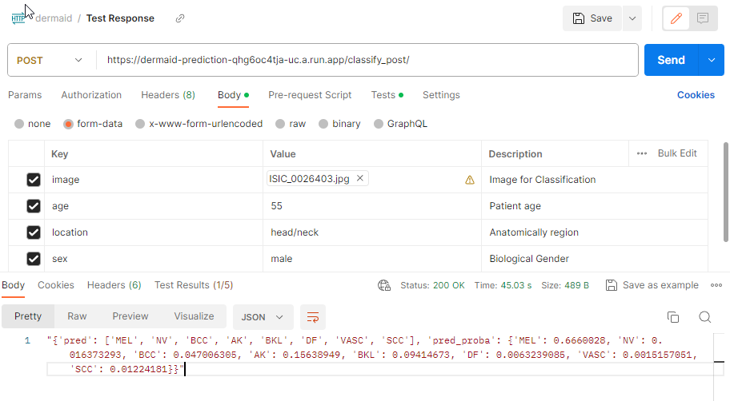
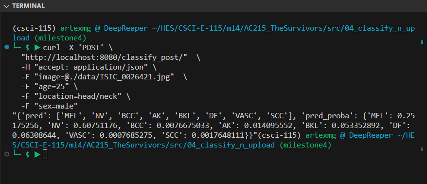

# Prediction API for Dermatological Images

<a id="contents"></a>
## Table of Contents

1. [Cloud Run Deployment](#deployment)
2. [Usage](#usage)
3. [File Structure and dependencies](#dependencies)
4. [Prerequisites](#prerequisites)
5. [Challenges and Solutions](#challenges)


<a id="description"></a>
## Description


This API container utilizes a trained model from Google Cloud Storage (GCS) to classify new dermatological images. FastAPI provides the RESTful API for classification, allowing the front-end application to upload images and associated metadata. Post-classification, both metadata and images (raw & preprocessed) are uploaded to GCS. The container also includes a Command Line Interface (CLI) tool for similar operations. The data processed here is further utilized by containers 5 and 6 for generating Saliency Maps and Labelling.


<a id="deployment"></a>
## 1. CloudRun Deployment
[Return to Table of Contents](#contents)


There are 2 options for deployment:

1. Local WebService: This creates and deploys the docker container, launches the webservice using FastAPI and pushes the container process into the backrgound. Hence, there is no direct access to the container in this mode.
    Deployment command:
    ```
    sh ./docker-shell.sh
    ```

2. CloudRun: the callable container is deployed on Google Cloud Run, and accessible from an either Web or Command line (e.g. curl). 

**Google Cloud Authentication:** For local webservice deployment, place your Google Cloud Service account key JSON file in the secrets directory. The Docker container is set up to look for the key at `secrets/ac215-dermaid.json`.

<a id="usage"></a>
## 2. Usage
[Return to Table of Contents](#contents)

Automatically deploy a webservice using FastAPI on port 8080 of either localhost or Clour Run


* Load patient images and metadata from Google Cloud Storage (GCS).
* Predict dermatological conditions using a pre-trained model.
* Upload the generated images back to GCS.
* Return the relevant information to the client as a JSON


#### Parameters (Form fields required)
* **image**: image file upload
* **age**: approximate age of the user, values from [0, 5, 10, 15, ... 85]
* **location**: the anatomical site of the lesion
* **sex**: gender of the user

Note: A set of sample images is provided in the ./data directory for testing.


<a id="webfeatures"></a>
### 2.1. Web-Service usage
The API is accessible via a web interface, which uses the GET protocol. Calls return relevant information as a JSON response.

To make a request, you can use FastAPI's built-in tool (Fast API Swagger) at:

Local: http://localhost:8080/docs

Cloud Run: https://dermaid-prediction-qhg6oc4tja-uc.a.run.app/docs 

Note: cloud run link is NOT the production one, and could change in the future. It is provided as an example.

**Screenshot Web request/response using postman:**  



<a id="clifeatures"></a>
### 2.2. CLI usage

The API can be invoked from the command line. The endpoint could either be local (localhost) or from a Cloud Run deployment.

#### Local call example
```bash
curl -X 'POST' \
  "http://localhost:8080/classify_post/"  \
  -H "accept: application/json" \
  -F "image=@./data/ISIC_0026421.jpg"  \
  -F "age=25" \
  -F "location=head/neck" \
  -F "sex=male"
```
**Screenshot Command Line Curl request/response:**  




<a id="dependencies"></a>
## 3. File Structure and dependencies
[Return to Table of Contents](#contents)

- (01)  src/04_classify_n_upload/mock_app_prediction.py - Contains a basic wrap for FastAPI to expose the inference engine as a web app.

- (02) src/04_classify_n_upload/requirements.tx - We use the following packages to support image classification:

    - google-cloud-storage to connect to GCS
    - pillow to manipulate the images
    - pandas for saving metadata as csv
    - fastapi and python-multipart for implementing FastAPI with multipart/form-data
    - uvicorn and gunicorn as the web server hosting the FastAPI

- (03) src/04_classify_n_upload/Dockerfile - The dockerfile uses the official Docker image tensorflow/tensorflow. This install the latest Tensorflow ready container, and the dependencies in the Docker container and uses secrets to connect to GCS.

- (04) src/04_classify_n_upload/docker-shell.sh and src/04_classify_n_upload/docker-shell.bat the scripts on unix and Windows to build the docker and run it

- (05) src/04_classify_n_upload/sample_curl.sh - the sample curl command to connect to the RESTful API for inference, and the sample response

To execute the shell script:
```bash
$ sh ./docker-shell.sh
```

<a id="prerequisites"></a>
## 4. Prerequisites
[Return to Table of Contents](#contents)

* Docker
* Google Cloud Storage Python SDK
* Access to Google Cloud Services with a secret JSON key file.
* Cloud Run deployment

## Notes:
Modify the **bucket_name**, **models_folder**, **augmented_training_data_folder** variables in the script as per your GCS setup.

<a id="challenges"></a>
## 5. Challenges and Solutions

### Challenge: Resource Quota Limitations on Cloud Run

**Context:** Once our endpoint was transitioned to Cloud Run, we faced the significant challenge of ensuring that the resources consumed by the service did not exceed our allocated quota.

**Solution:** To address this, we are frequently monitoring of the server's performance, especially focusing on response times. This allowed us to anticipate potential issues, adjust as needed, and ensure consistent service availability. As of this update, we have successfully maintained uninterrupted service, ensuring our users can rely on our platform's efficiency and reliability.

[Return to Table of Contents](#contents)

