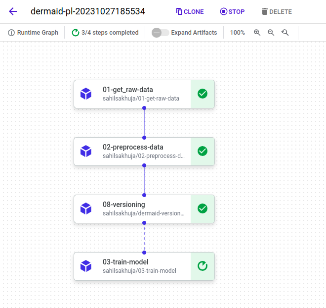
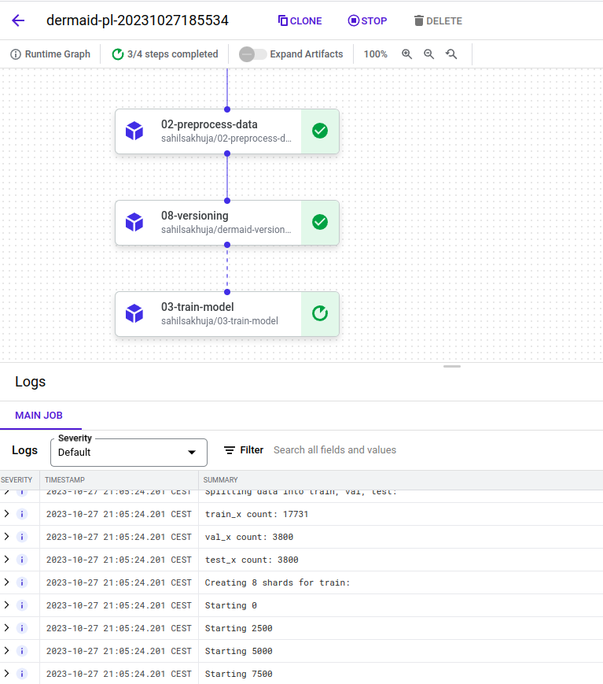
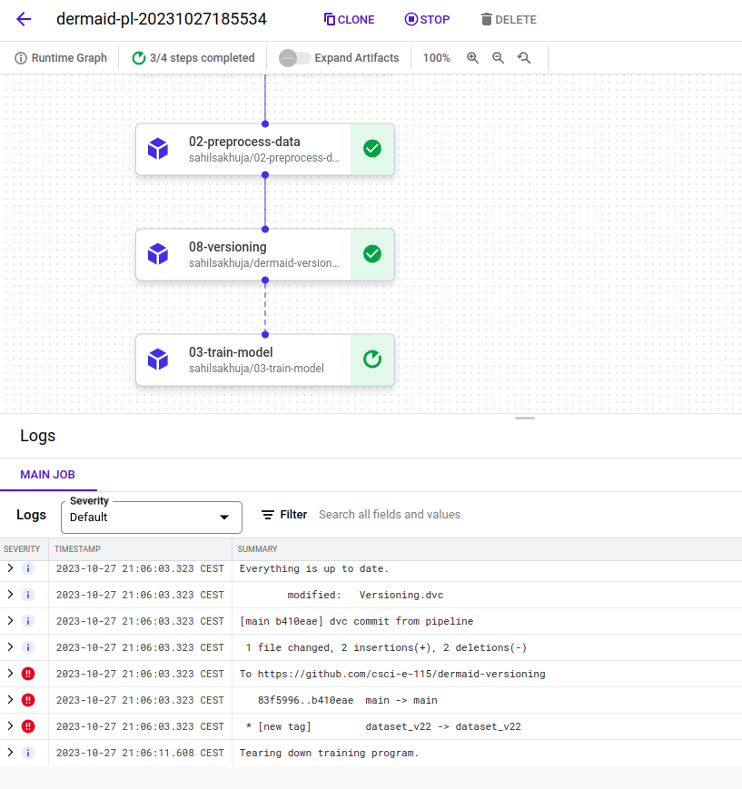
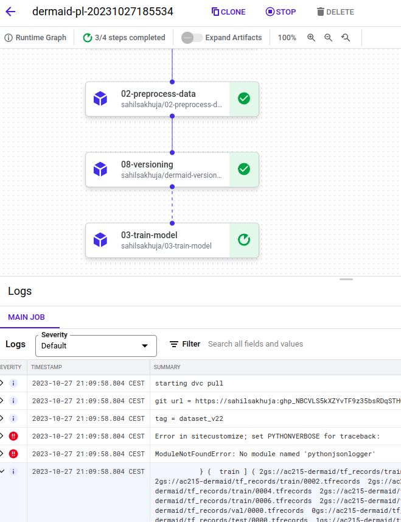

# VertexAI Pipeline Runner

This container constructs the Kubeflow Pipeline and submit to Vertex AI to run. It will compile the defined pipeline and container configuration into pipeline.yaml for job submission.
It assumes containers it used in the pipeline to have already been uploaded to a container repo such as dockerhub. In this case they are:
  - container 1: crispinnosidam/01-get-raw-data
  - container 2: crispinnosidam/02-preprocess-data
  - container 3: sahilsakhuja/dermaid-versioning
  - container 4: crispinnosidam/03-train-model

## Deployment

### To deploy this container locally run

```bash
  sh docker-shell.sh
```

## File structure and dependencies

(01) `src/09_run_kfp/run-kfp.py` - This is the CLI application to build the pipeline.yaml and submit to Vertex AI to run the pipeline
- parameter used:
  - --run-containers or -r <container # (1-4)>
    - This parameter can be included multiple times to specify multiple container with sequential dependency
  - -t <tag_name>

  e.g.: `python run-kfp.py -r 1 -r 2 -r 3 -r 4 -t dataset_v22` creates and submits a pipeline using container 1/2/3/4 defined above and uses tag name "dataset_v22" to version the data.

(02) `src/09_run_kfp/Pipfile` - We used the following packages to support the CLI application:
- `google-cloud-aiplatform` - for interaction with Google Vertex AI
- `kfp` - to construct Kubeflow pipeline

(03) `src/09_run_kfp/Pipfile.lock` - See description of Pipfile under (02).

(04) `src/09_run_kfp/Dockerfile` - The dockerfile uses `python:3.9-slim-buster`. It installs dependencies in the Docker container and uses secrets to connect to GCS.

(05) `src/09_run_kfp/docker-entrypoint.sh` - entrypoint used by Dockerfile, configures google environment using gcloud commands.

(06) `docker-shell.sh` or `docker-shell.bat`- This shell script automates the process of setting up the Docker environment for the `06-dermaid-data-label-cli` container. It performs the following tasks:
- Builds the Docker image for the CLI application using the specified Dockerfile.
- Starts the Docker container by supplying correct variables needed by the pipeline, some of them contains privileges read from the `secrets` directory, including:
  - `ac215-dermaid.json` containing privilege to the service account
  - `wandb.txt` containing the key to wandb
  - `whylabs.txt` container the key to whylabs
- it expects the existence of git.env which contain the variable GIT_LOGIN with login information to github, in the format of:
  - GIT_LOGIN=`https://<github login>:<github token>`
- `docker-shell.sh` is for unix systems and `docker-shell.bat` is for Windows

## Challenges & Solutions
- Unlike using docker run where environment variables can be passed with the docker command, required environment variables need to be passed from the 11-run-kfp container, and incorporated into command line in Kubeflow container components. Depends on syntax complexity, it needs to be passed as parameters of run-commands.sh instead of environment variables like in container 3.
- Unlike using docker run where local directories can be mounted, docker needs to be self-contained and obtain whatever file as part of the start up. This includes:
  - `secrets` folder
    - Instead of passing credentials when python code is run, service account needs to be specified during pipeline job submit. This implies all hard coded references of credential files needs to be removed.
    - For other access keystrings like GitHub and WandB, they need to be passed as parameter, obtained as environment variables from container 11-run-kfp.
  - Temporary files like downloaded git repo used by DVC
    - This cannot be mounted from a local location and full git clone along with submodule for container 8 needs to be done on the fly, with run-commands.sh.
- CPU/MEM/GPU requirements need to be defined as part of the pipeline definition
- As containers needs to be uploaded to DockerHub, the sequencing of layers in Dockerfile needs to be carefully managed to avoid small changes invalidating layers that takes long time to build, such as those with OS software installation and `pipenv install`
- Cloud jobs submission is extremely slow - all tests need to be done carefully on local before doing the same on cloud

##### Vertex AI Pipeline

Pipeline executing all steps:




TF Record Shards created from Container 2




Dataset V22 created and versioned using DVC




Dataset V22 fetched by container doing model training and training started


